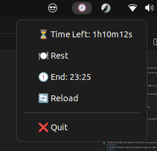

# Time left ⏲

[](https://godoc.org/github.com/ismtabo/time-left) [](https://goreportcard.com/report/github.com/ismtabo/time-left)

This is a simple countdown timer that can be used to track the time left until the end of the work day.



## Usage

To use this timer, simply run the script and it will display the time left until the end of the work day.

```bash
time-left [options]
```

A systray icon will appear in your system tray. Click on it to see the time left until the end of the work day.


This script can be used to track the time left until the end of the work day. It shows the time left until the end of the work day in the system tray, and the end of the work day. It can be configured to start at a specific time and to last for a specific duration. It can also be configured to take a rest time. See [Configuration](#configuration) for more information.

In addition, by clicking the "Rest" button, the script will add the rest time to the end of the work day. Use the "Reload" button to reload the configuration file and the "Quit" button to close the program.

### Options

The following options are available:

```bash
  -c, --config string   The path to the configuration file (default "$HOME/.config/time-left/config.yaml")
```

## Installation

**Caveat:** Remember to create configuration file before running the script. See [Configuration](#configuration) for more information.

### Requirements

Readmore about systray requirements [here](https://github.com/getlantern/systray#platform-notes).

### Using go get

To install this script, simply run the following command:

```bash
go install github.com/ismtabo/time-left@latest
```

### Source
To install this script, simply clone the repository and build the binary:

```bash
git clone
cd time-left
make build
```

## Configuration

The script can be configured by editing the `config.yaml` file in your XDG config directory (`$HOME/.config/time-left/config.yaml`). 

### Configuration Properties

| Property | Description | Required | Example | Default value |
|:---|:---|:---|:---|:---|
| `start` | The time when the work day starts (HH:mm) | Yes | `09:00` | |
| `duration` | The duration of the work day as a duration string[^1] | Yes | `7h30m` | |
| `rest` | The duration of the rest time as a duration string[^1] | No | `30m` | `1h` |
| `refresh` | The refresh interval as a duration string[^1] | No | `1s` | `30s` |
| `truncate` | The truncate value as a duration string[^1]. This will truncate the time left to the nearest value. See more [time.Truncate](https://pkg.go.dev/time#example-Duration.Truncate).  | No | `30m` | `1m` |

[^1]: **Duration strings**: see more [time.ParseDuration](https://pkg.go.dev/time#ParseDuration).

Use the following snippet to configure the script:

```yaml
# The time when the work day starts
start: 09:00
# The duration of the work day as a duration string
duration: 8h
# (Optional) The duration of the rest time as a duration string
rest: 30m
# (Optional) The refresh interval as a duration string
refresh: 30s
# (Optional) The truncate value as a duration string. This will truncate the time left to the nearest value
truncate: 1m
```

See [config.yaml](./docs/samples/config.yaml) as an example.

## Contributing

To contribute to this project, please fork the repository and submit a pull request.

## License

This project is licensed under the MIT License - see the [LICENSE.md](LICENSE.md) file for details

## Acknowledgements

This project was inspired by the need to track the time left until the end of the work day.

- getlantern/systray: https://github.com/getlantern/systray

## Contributors

- [@ismtabo](https://github.com/ismtabo) (author)
